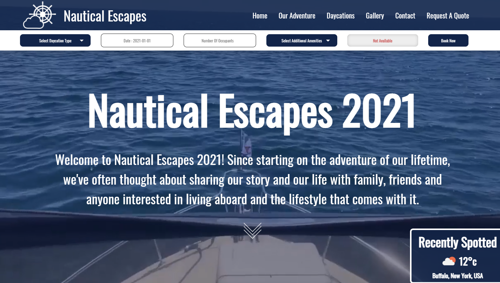
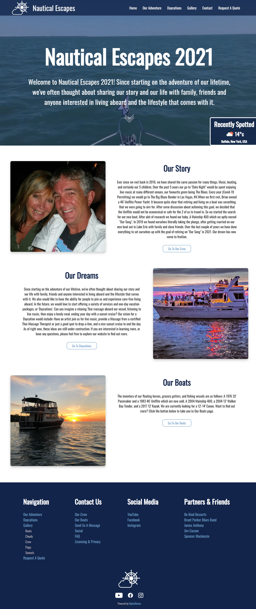
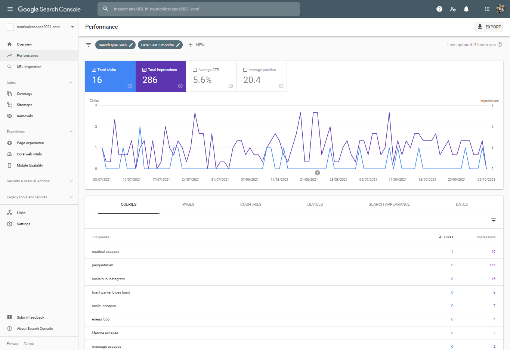
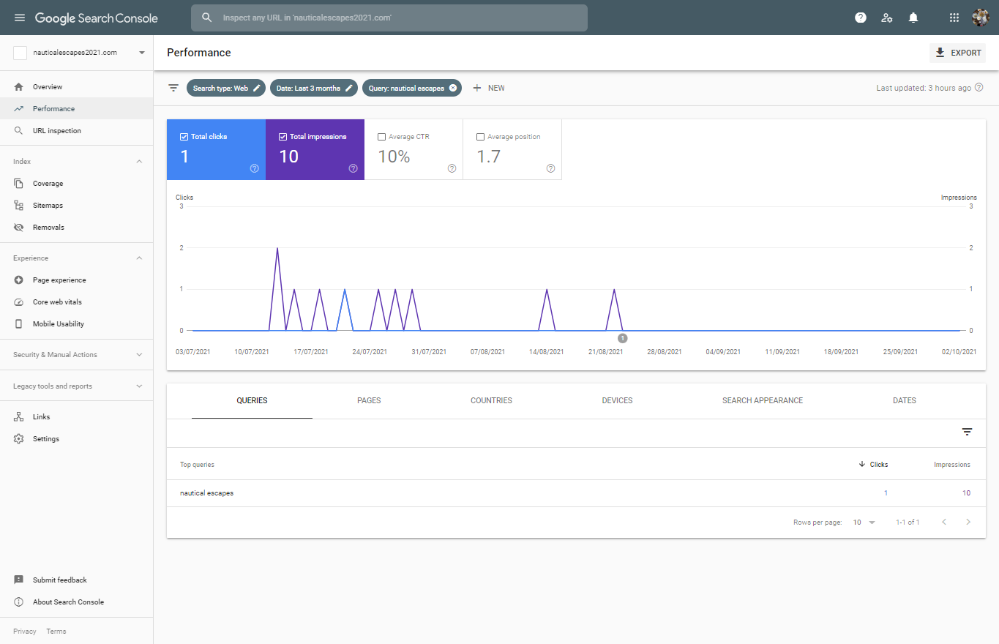
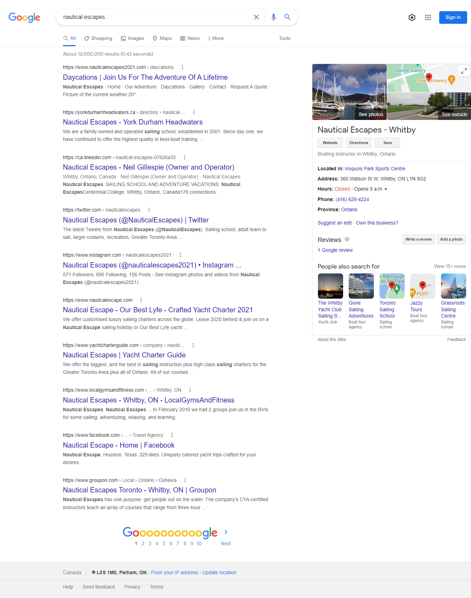
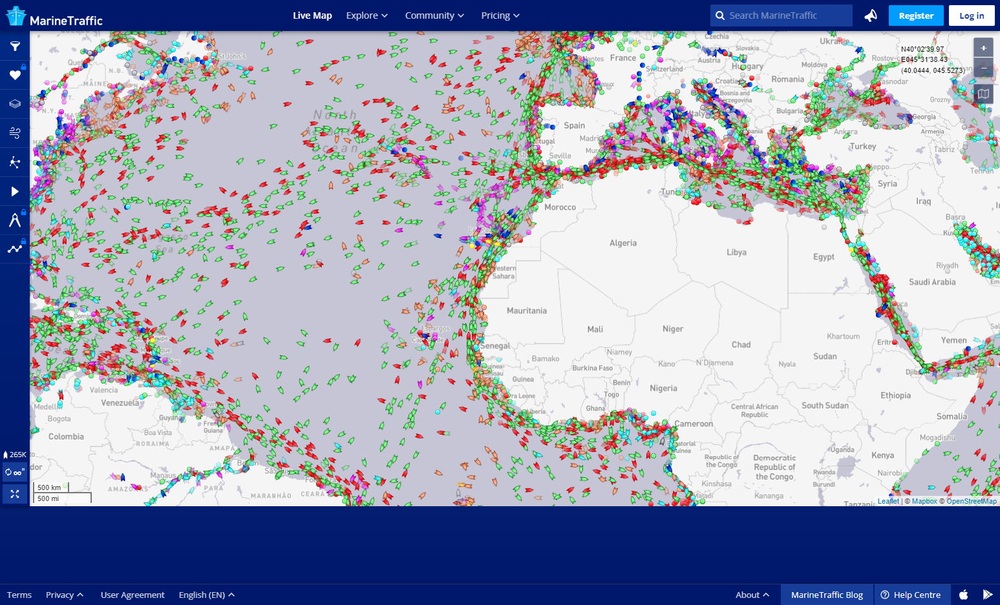
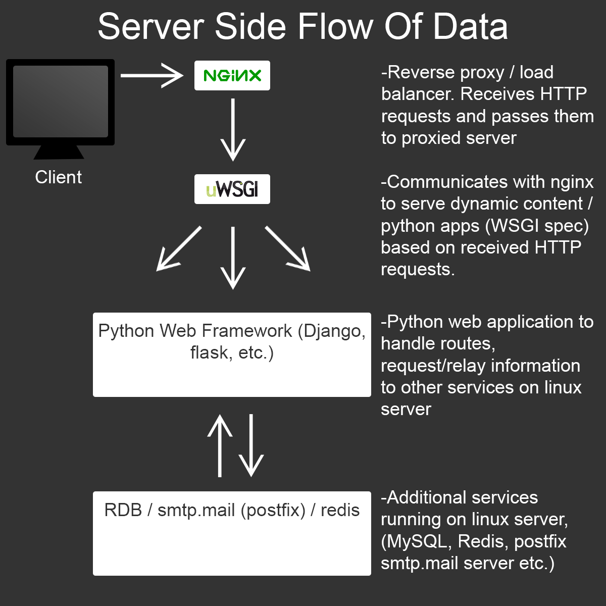
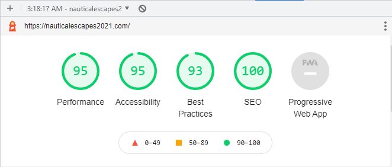

# Nautical Escapes 2021

***https://nauticalescapes2021.com***

Base Website Design For Nautical Escapes 2021, with any sensitive information removed. 

***Homepage with bottom navbar, (bottom navbar removed in production until clients acquire necessary licenses)***

***Homepage Production Version***

-Screenshots taken with Google Chrome Inspector Commands-

***Personal Thoughts***

This was my first large-scale project where I was completely in charge of developing all aspects of the website, and in addition I had moderately strict time requirements to uphold, so I felt a lot of pressure going into this project. Looking back would have done many things differently, however, I'm proud of the unique system that I created to receive and format information directly from the client, which will save the client a ton of time in the future. I'm very happy with the asthetic of the website, and when I have more time I have plans to go back and add in the animations that I have created all over the website.

***Search Engine Optimization***

I was asked to delay any specific long-tail keyword optimization until COVID-19 ends, as the owners were hesitant to advertise their business before they were ready to launch. Notwithstanding that, I was able to ensure that nauticalescapes2021.com returned the number one result for 'nautical escapes' or 'nautical escapes 2021'.

Google Search Console - All Queries

Google Search Console - Query ['nautical escapes']

Google Search Results Page

***Geolocation / Marine AIS Solution***

One of the main requirements, and the most worrying technical challenge for me when I started this project was the business owners desire to integrate Marine A.I.S tracking systems into the implementation of the 'blogish' features on the website. 

At the beginning I had a very limited understanding of marine tracking intelligence systems, but given time I was able to look into a number of solutions for creating an automated system to receive AIS signals (VHF transceivers are able to receive signals from AIS), and update the website accordingly, however, in the end, the most efficient solution was to, (with permission), piggyback off of a service that receives AIS signals and records vessel locations in real-time. After setting all this up, and ensuring that I would be able to set-up what was needed, in the end, the business owners decided not to install AIS onboard their vessel anyways, but I still consider the entire process a valuable learning experience.

The current implementation of the geolocation tracking is much simpler, and does not run in real-time at all, for both financial and security reasons. When the business owners would like to place a pin on the leaflet.js map system (https://nauticalescapes2021.com/ouradventure), they simply authenticate using a trusted device, then complete a simple web form, filling in the necessary information, while the web browser uses the cellular data to provide an accurate latitude and longitude. 

***Server Side Flow Of Information/Data***

Documentation / Blogs : 
https://uwsgi-docs.readthedocs.io/en/latest/ (Official uWSGI docs)
https://docs.nginx.com/nginx/admin-guide/web-server/reverse-proxy/ (Official nginx docs)
https://www.ultravioletsoftware.com/single-post/2017/03/23/An-introduction-into-the-WSGI-ecosystem (A helpful blog-post breaking down the different parts of the WSGI ecosystem)
https://goutomroy.medium.com/request-and-response-cycle-in-django-338518096640 (Request and response life cycle in Django, I found helpful for understanding the flow of information)

***Google Inspector Lighthouse Results***

